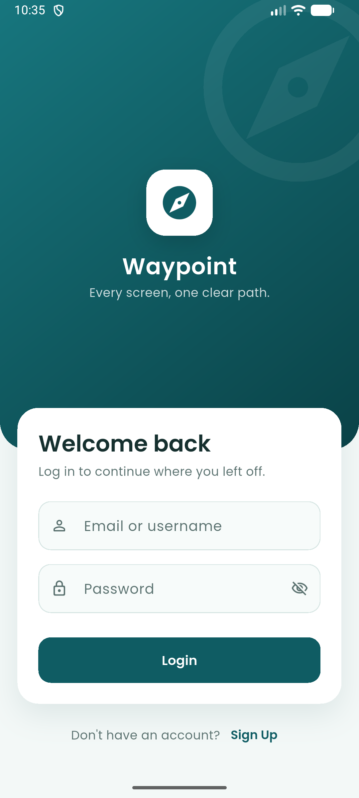
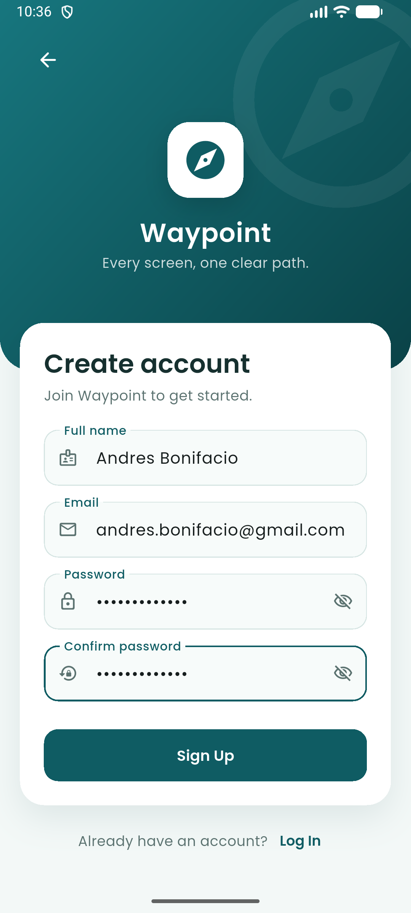
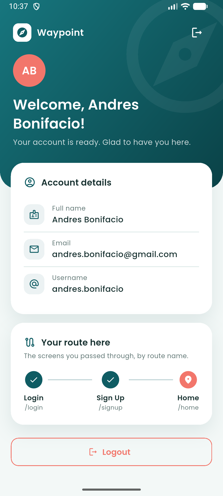
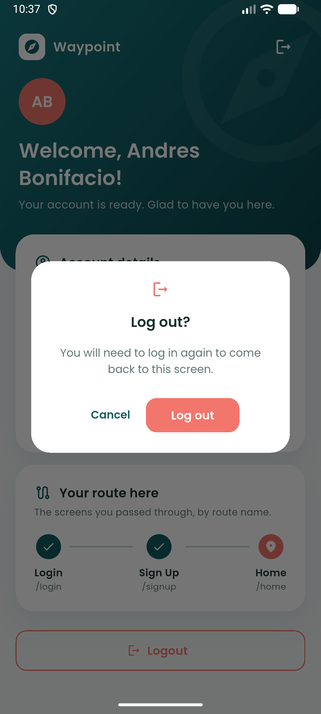
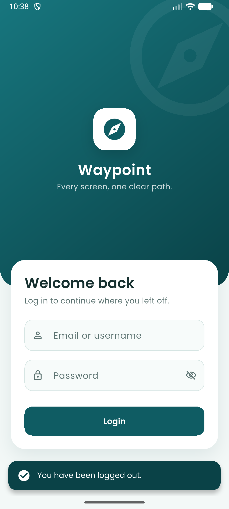
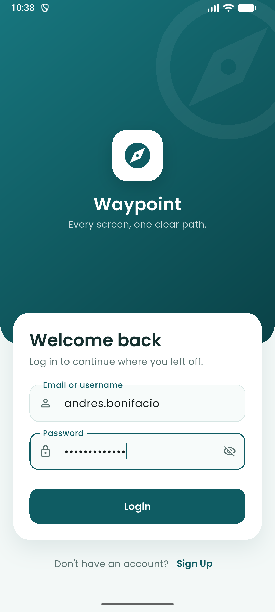
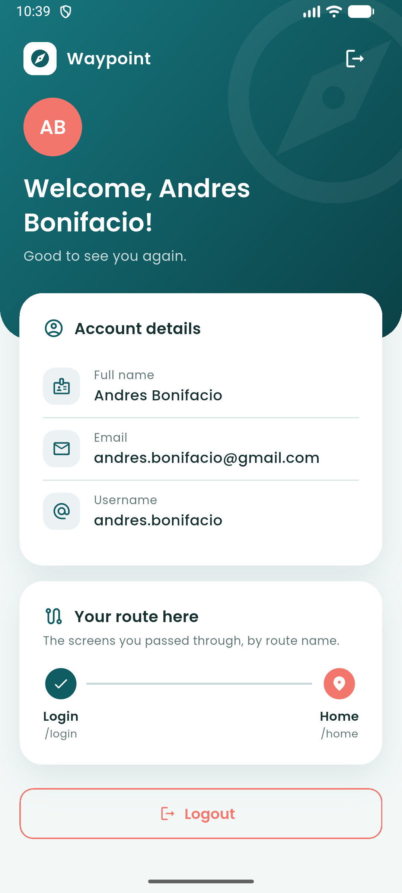

# Waypoint — ITP107 Finals Laboratory 1

**Routes and Navigation in Flutter: Login → Sign-Up → Home**

ITP107 – Mobile Application Development · Section 3-ITA · Group 15 · Sir Albert Alforja

A three-screen Flutter app where every screen is a named route. The name entered
on the Sign-Up screen reaches the Home screen through route arguments.

## Screenshots

Taken from the app running on an Android emulator. They follow the full flow:
sign up, log out, then log back in with the new account.

### 1. Sign up — `/login` → `/signup` → `/home`

<table>
  <tr>
    <td align="center"></td>
    <td align="center"></td>
    <td align="center"></td>
  </tr>
  <tr>
    <td align="center" valign="top"><b>Login</b><br>The app opens here. Tap <i>Sign Up</i> to create an account.</td>
    <td align="center" valign="top"><b>Sign-Up</b><br>Full name, email, password and confirm password.</td>
    <td align="center" valign="top"><b>Home</b><br>The welcome message shows the name passed in the route arguments.</td>
  </tr>
</table>

### 2. Log out — `/home` → `/login`

<table>
  <tr>
    <td align="center"></td>
    <td align="center"></td>
  </tr>
  <tr>
    <td align="center" valign="top"><b>Logout</b><br>Tapping Logout asks for confirmation first.</td>
    <td align="center" valign="top"><b>Back to Login</b><br>Login shows "You have been logged out."</td>
  </tr>
</table>

### 3. Log back in — `/login` → `/home`

<table>
  <tr>
    <td align="center"></td>
    <td align="center"></td>
  </tr>
  <tr>
    <td align="center" valign="top"><b>Login</b><br>Log in with the email or the username (the part before the @).</td>
    <td align="center" valign="top"><b>Home</b><br>"Good to see you again." The route card shows <code>/login</code> → <code>/home</code>.</td>
  </tr>
</table>

## Group 15 members and roles

| Member | Role |
| --- | --- |
| Cosme, Liuri Lien P. | Navigation & Routing Lead |
| Baculinao, Mark Joseph | UI/UX Designer |
| Del Rosario, Mikaela Denisse | Integration & Testing Lead |

## Named routes and Navigator methods

All routes are defined in [`lib/routes/app_routes.dart`](lib/routes/app_routes.dart)
and registered in `MaterialApp` through `onGenerateRoute`.

| Route name | Screen | Arguments |
| --- | --- | --- |
| `/login` | `LoginScreen` (initial route) | Optional `String` message, e.g. "You have been logged out." |
| `/signup` | `SignUpScreen` | None |
| `/home` | `HomeScreen` | `HomeArgs` (full name, email, and whether the user just signed up) |

| Navigator method | Used for |
| --- | --- |
| `Navigator.pushNamed` | Login → Sign-Up, so Sign-Up can go back |
| `Navigator.pop` | Sign-Up → Login (back arrow and "Log In" link), and closing the logout dialog |
| `Navigator.pushNamedAndRemoveUntil` | Sign-Up → Home, clearing Login and Sign-Up from the stack |
| `Navigator.pushReplacementNamed` | Login → Home, and Home → Login on Logout, so Back cannot return |

Opening `/home` without `HomeArgs`, or any unknown route name, falls back to Login.

## How to run

```bash
flutter pub get
flutter run            # Android emulator or device
flutter run -d chrome  # or in Chrome
flutter test           # navigation and validation tests
```

Accounts are kept in memory only (there is no backend in this lab), so they are
cleared when the app restarts. Sign up first, then log in with that account.

## Project structure

```
lib/
├── main.dart                   MaterialApp: theme, initial route, onGenerateRoute
├── routes/app_routes.dart      Route names, HomeArgs, route builder, transition
├── screens/                    login_screen, signup_screen, home_screen
├── data/account_store.dart     In-memory accounts created on Sign-Up
├── theme/                      Colour palette and the shared ThemeData
└── widgets/                    Header, card, text field and link shared by the screens
assets/fonts/                   Poppins (SIL Open Font License)
test/widget_test.dart           Navigation and validation tests
```
